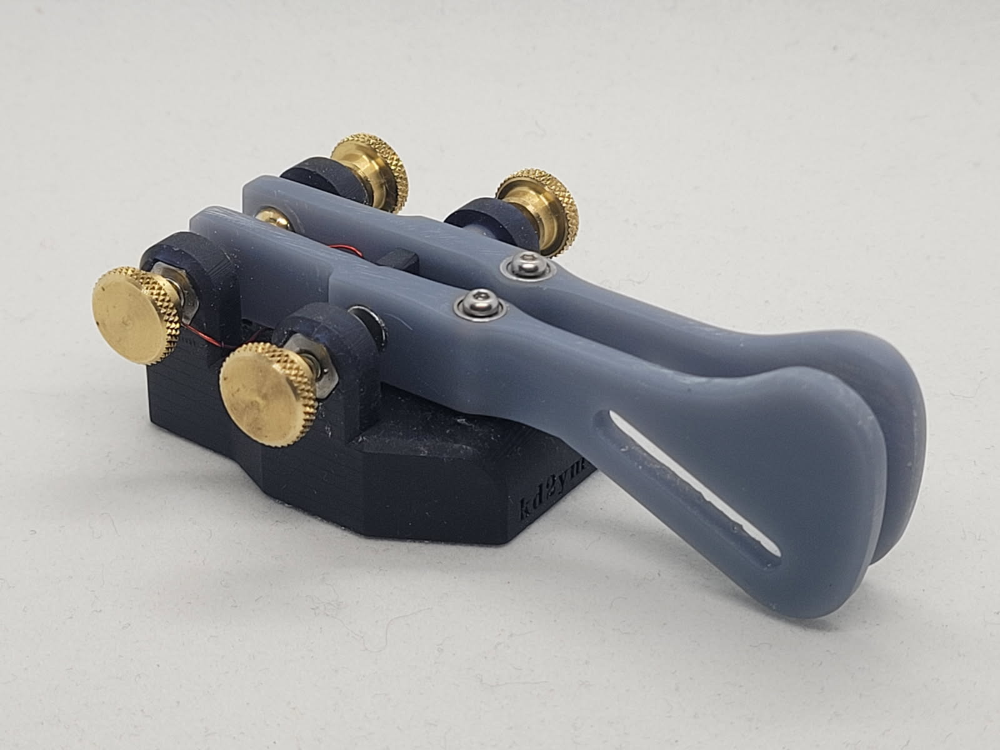
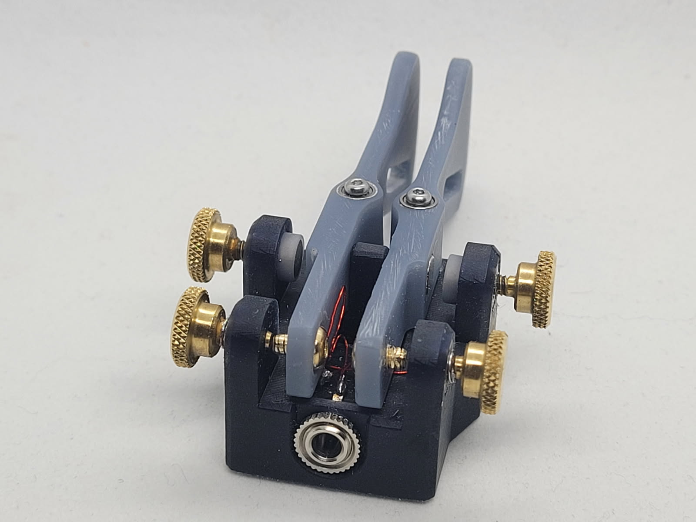
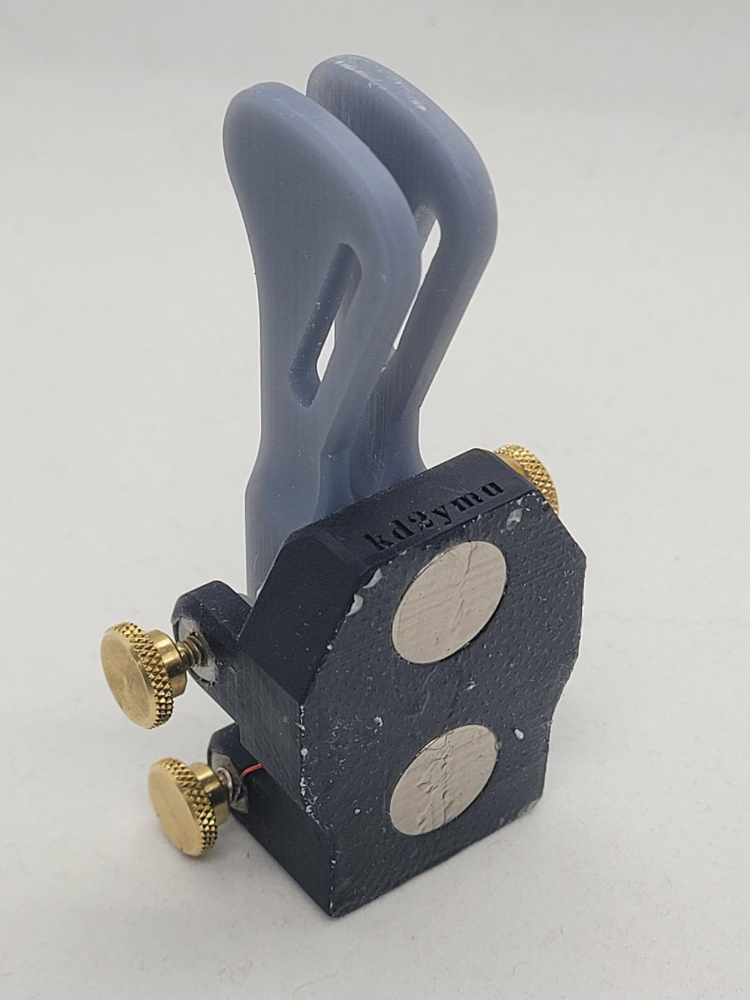
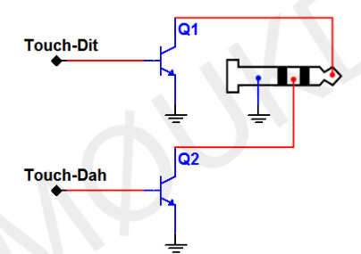

# N2 Iambic Paddle - Open Source
I made this Iambic Paddle and figured i'd share it for anyone else who wants to make their own. 
Feel free to modify it as you see fit, and if you'd like to make a pull request to improve the design/documentation, feel free to do so.

The design files (SolidWorks 2022) are included in this directory as well as the STL/STEP/3MF files for 3D printing.

The [Bill of Materials](#bill-of-materials) can be found below.

# Images

# Bill of Materials
All prices are referenced on 2024-03-24

Many of these compoenets can be found cheaper elsewhere or replaced with similar components.
However, this list of components is guaranteed to work as is.

| Qty | Unit | McMaster-Carr Part # | Description | Delivery | Price/Unit | Total Price |
|---|---|---|---|---|---|---|
| 1 | Pack | [92095A503](https://www.mcmaster.com/92095A503) | Button Head Hex Drive Screw Passivated 18-8 Stainless Steel, M2 x 0.40 mm Thread Size, 14 mm Long | $10.14 | $10.14 |
| 4 | Each | [98816A216](https://www.mcmaster.com/98816A216) | Brass Raised Knurled-Head Thumb Screw 4-40 Thread Size, 1/4" Long | $2.72 | $10.88 |
| 1 | Pack | [94459A120](https://www.mcmaster.com/94459A120) | Heat-Set Inserts for Plastic Brass, M2 x 0.4 mm, 4 mm Installed Length | $9.36 | $9.36 |
| 1 | Pack | [91841A005](https://www.mcmaster.com/91841A005) | 18-8 Stainless Steel Hex Nut 4-40 Thread Size | $3.69 | $3.69 |
| 1 | Each | [5734N13](https://www.mcmaster.com/5734N13) | Circuit Board Audio Equipment Connector 90 Degree Elbow Receptacle, Off, Stereo Pin Connection | $5.12 | $5.12 |
| 2 | Packs | [97715A424](https://www.mcmaster.com/97715A424) | Brass Button Head Hex Drive Screws 4-40 Thread Size, 3/16" Long | $1.97 | $3.94 |
| 2 | Each | [5862K145](https://www.mcmaster.com/5862K145) | Neodymium Magnet Magnetized Through Thickness, 1/16" Thick, 1/2" OD | $1.20 | $2.40 |
|  |  |  | **Total** |  |  | **$44.53** |

# Assembly Instructions
1. Print the parts in the STL folder
2. Glue the hex nuts into the hex nut holders on the bottom of the base.
3. Insert the heat-set inserts into the holes on the bottom of the base. (A small amount of glue may be necessary for resin prints)
4. Insert the Aux Connector into the hole on the back of the base.
5. Solder thin wires to the Aux Connector. I used magnet wire.
   - You will need to solder two wires onto the ground pin to connect to the two brass thumb screws. Refer to [Wiring Diagram](#wiring-diagram)
6. Screw all 4 brass thumb screws into the hex nuts.
7. Insert the magnets into the Magnet Screw Connectors (a small amount of glue may be necessary). Make sure the magnets are oriented correctly.
8. Screw the Magnet Screw Connectors into the two front brass thumb screws.
9. Wrap the two wires connected to ground around the back two brass thumb screws (make sure the metal is exposed and creates a nice contact), or solder them to the hex nuts.
10. Insert the bearings into the paddle arms.
11. Glue the magnets into the paddle arms. Make sure the magnets are oriented correctly.
12. Screw in the back brass screw to the back of the paddle arms halfway.
13. Wrap the dah and dit wires shown in the [Wiring Diagram](#wiring-diagram) around the respective brass screws and tighten them down. Make sure the metal is exposed and creates a nice contact.
14. Screw the paddle arms into the base.
15. Glue the two neodymium magnets into the slots on the bottom of the base. Make sure the magnets are oriented correctly.
15. Test the paddle to make sure it works correctly.
16. Enjoy!

## Wiring Diagram

## Tips and Tricks
I applied a thin layer of E6000 glue to the bottom of the base to give it some grip on the table. This is optional but I found it to be helpful to prevent the paddle from sliding around.

I also applied some thread lock to the brass thumb screws to prevent them from moving, which allows for finer adjustment of the paddle tension and spacing.
